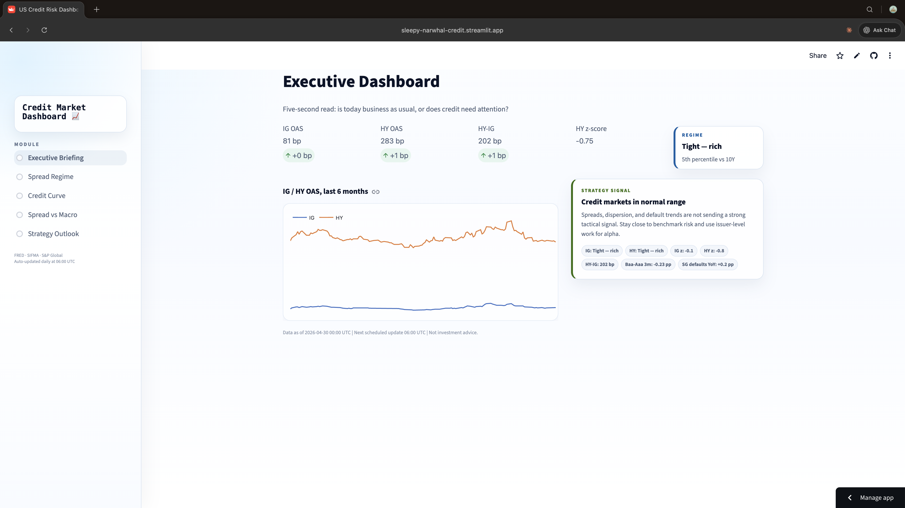
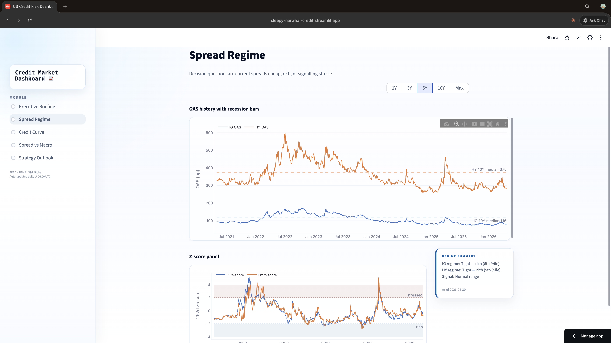
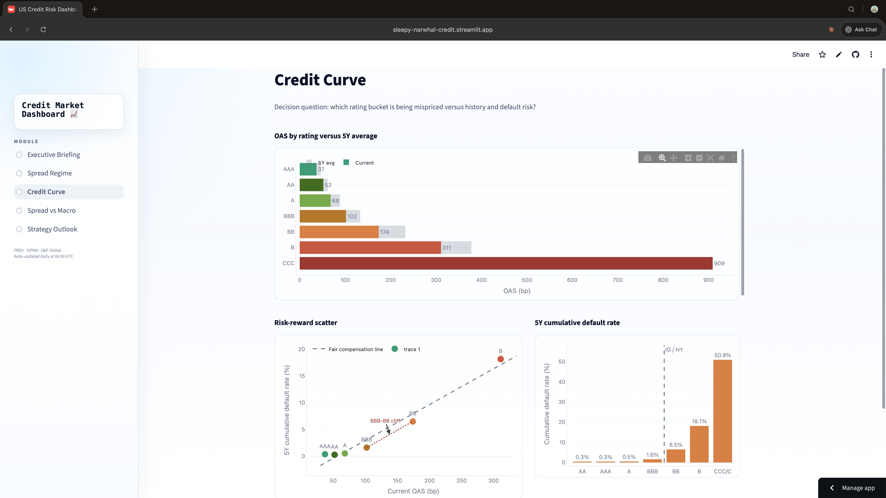
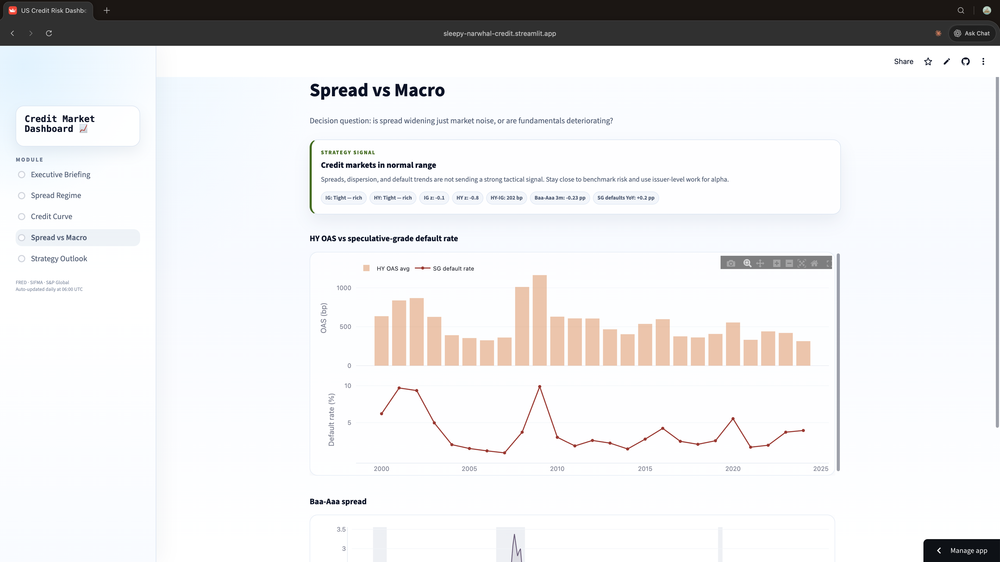
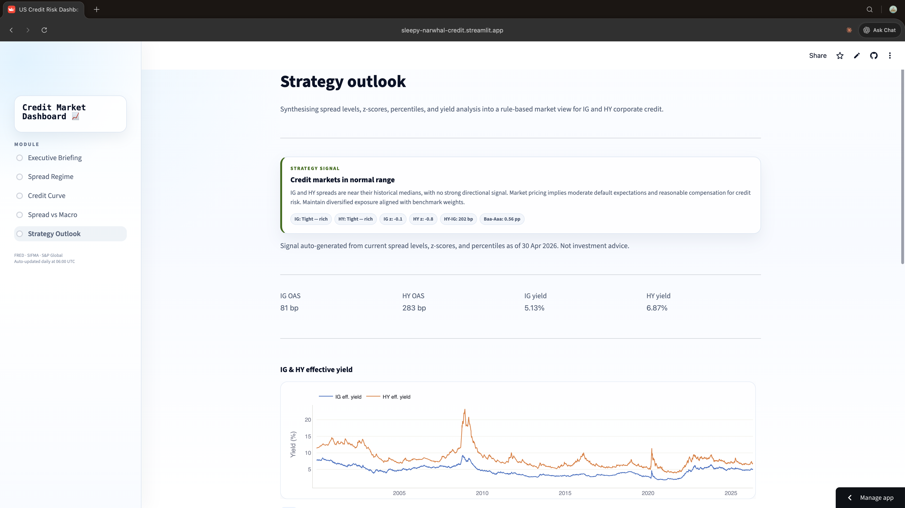

# US Credit Risk Intelligence Dashboard

A team project for *Advanced Computing in Policy* at Columbia SIPA.

**Live app:** [sleepy-narwhal-credit.streamlit.app](https://sleepy-narwhal-credit.streamlit.app)

---

## Project Overview

Our team built a **US Credit Risk Intelligence Dashboard** — a Streamlit application that consolidates credit market data from FRED, SIFMA, and S&P Global into a unified decision tool for monitoring corporate credit conditions. The dashboard is structured as a five-module funnel that takes users from a high-level executive read (*"Is today business as usual?"*) down to actionable strategy signals (*"How should I position?"*), with each page anchored to a specific decision question.

The core insight behind the product is that credit data is rich but fragmented. Anyone monitoring the market — portfolio managers, analysts, and even policymakers tracking systemic risk — has to stitch together the same set of indicators every morning from three different sources. The dashboard turns that recurring chore into a single five-second read, with progressively deeper layers available when the headline signal warrants attention.

## The Original Proposal — and Why We Changed It

The project started somewhere very different. My **initial proposal** was an intersection analysis between two NYC Open Data datasets: the *Daily Inmates in Custody* dataset and the *Hate Crime* dataset. The hypothesis was that demographic and temporal patterns across these two datasets might reveal something about how the criminal justice system responds differently to bias-motivated incidents versus general custody intake.

I scoped the idea, sourced and cleaned both datasets, and built an early exploratory dashboard to test what stories the data could actually tell. That exploration is where I learned my first real lesson on this project: **a good question doesn't guarantee good data**. Both datasets were structurally thin — limited fields, inconsistent categorizations, and no way to link individuals across them. We could chart trends and run correlations, but we couldn't build a multi-step analytical narrative. The depth simply wasn't there.

We talked through it as a team and decided to pivot. My teammate Gina, who has been studying for the CFA, suggested credit markets — a domain with rich, multi-layered, well-documented data and decades of established analytical frameworks. It also fit the policy computing course better than the original idea: credit spreads are an early-warning indicator that the Fed, Treasury, and IMF all use to monitor systemic risk. Pivoting halfway through felt uncomfortable at the time, but it taught me something I think I'll carry into future work: **scoping isn't a one-time decision at the start of a project — it's an ongoing judgment about whether the data can support the question you actually want to answer.**

## My Contributions

Beyond the original proposal and the first-version dashboard prototype, my role on the project shifted toward **product framing, narrative design, and team process** as we moved into the credit risk build:

- **Initial proposal and v1 dashboard.** I sourced and cleaned the original NYC datasets and built the first working version of the dashboard before we pivoted. Even though we didn't ship that version, the early prototyping forced us to confront the data limitations early, which made the pivot decision much faster than it would have been otherwise.

- **Markdown documentation.** I authored the project's markdown documentation throughout the build, including the proposal write-ups and supporting docs. As the credit version of the app evolved, I maintained the proposal documentation to keep it aligned with the live build.

- **Bug triage and reporting.** I handled bug reports as they came up — reproducing issues, narrowing down what was actually broken, and routing fixes to the right teammate.

- **Presentation design.** For the live presentation, I owned the opening framing — the *"why this project, why this pivot, why credit markets matter for policy"* narrative — and the live app walkthrough, where I designed the page-by-page story that connects the five modules into a coherent decision funnel rather than five disconnected charts. Translating the technical content into language a non-finance audience could follow in five minutes was harder than I expected, and pushed me to genuinely understand the analytical logic rather than just describe it.

- **Team process — retros and prioritization.** During our prioritization exercises and retrospectives, I took the meeting notes, consolidated them into our shared template, and produced the clean digital outputs the team referenced afterward. This isn't glamorous work, but I came to appreciate how much it matters — without a written record of *what we decided and why*, a small team loses an enormous amount of context between meetings.

## What I Learned

Three things stand out.

**First, domain knowledge changes what you can build.** I came into this project with zero background in fixed income. By the end, I could explain why the BBB-BB boundary matters, why option-adjusted spreads are the right unit for comparing across rating buckets, and why a z-score panel is a more honest way to communicate "stress" than an absolute level chart. That knowledge wasn't a side effect — it was the precondition for designing a walkthrough that actually made sense. **You can't narrate a product you don't understand.**

**Second, the unglamorous work compounds.** Taking notes, maintaining documentation, fixing small bugs, keeping the proposal aligned with the live build — none of this looks impressive on a slide. But over the project's lifecycle it was the difference between a team that knew what it was doing and a team that kept relitigating old decisions. I want to do more technical work on future projects, but I no longer think of process work as a downgrade — it's a different kind of leverage.

**Third, pivots are a feature, not a failure.** The version of the project we shipped is significantly better than the version I originally proposed. The reason it's better is that we were willing to throw out work we'd already done when we realized the underlying data couldn't carry the analytical weight we wanted. I would have found that very hard to do at the start of the semester. I find it less hard now.

## Tech Stack & Data Sources

**Stack:** Streamlit · Python · BigQuery
**Data sources:** FRED (Federal Reserve Economic Data) · SIFMA · S&P Global

## Screenshots

*Executive Dashboard — the five-second read landing page*

*Spread Regime — historical context for the headline signal*

*Credit Curve — structural drill-down by rating bucket*

*Spread vs Macro — fundamentals cross-check*

*Strategy Outlook — synthesized decision signal*

---

*Course: Advanced Computing in Policy · Columbia SIPA · Spring 2026*
